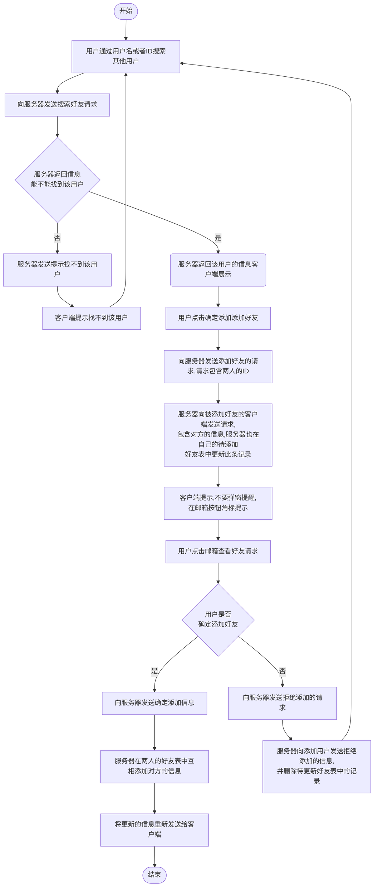

```mermaid
graph TD
A([开始]) --> D[用户通过用户名或者ID搜索其他用户]
--> 向服务器发送搜索好友请求 --> B{服务器返回信息
能不能找到该用户} -->|否| 服务器发送提示找不到该用户 --> 客户端提示找不到该用户 --> D
B -->|是| G(服务器返回该用户的信息客户端展示)
--> 用户点击确定添加添加好友 --> 向服务器发送添加好友的请求,请求包含两人的ID --> 服务器向被添加好友的客户端发送请求,\n包含对方的信息,服务器也在自己的待添加\n好友表中更新此条记录 --> 客户端提示,不要弹窗提醒,在邮箱按钮角标提示 --> 用户点击邮箱查看好友请求 --> L{用户是否
确定添加好友} -->|是| 向服务器发送确定添加信息 --> 服务器在两人的好友表中互相添加对方的信息 --> 将更新的信息重新发送给客户端 --> E([结束])

L -->|否| 向服务器发送拒绝添加的请求 --> 服务器向添加用户发送拒绝添加的信息,\n并删除待更新好友表中的记录 --> D
```