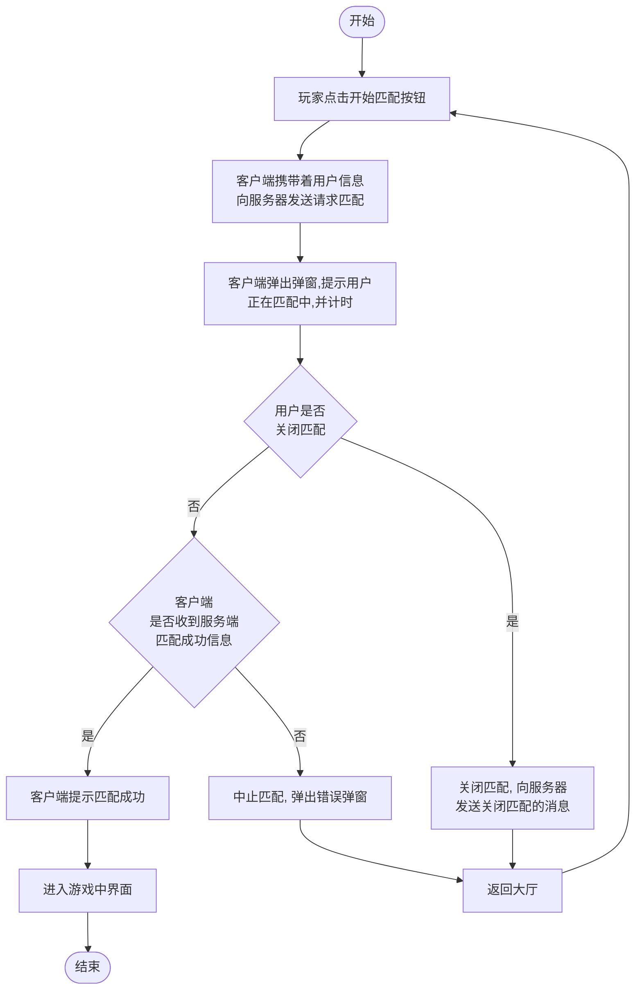

```mermaid
graph TD
    Start([开始]) --> button[玩家点击开始匹配按钮] --> send[客户端携带着用户信息
    向服务器发送请求匹配] --> pop[客户端弹出弹窗,提示用户
    正在匹配中,并计时] --> close{用户是否
    关闭匹配} -->|否| SUCCESS{客户端
    是否收到服务端
    匹配成功信息} 
    close -->|是| closematch[关闭匹配, 向服务器
    发送关闭匹配的消息] -->
    lobby[返回大厅] --> button
    SUCCESS -->|是| tips[客户端提示匹配成功] --> entergame[进入游戏中界面] --> End([结束])
    SUCCESS -->|否| error[中止匹配, 弹出错误弹窗] --> lobby

```