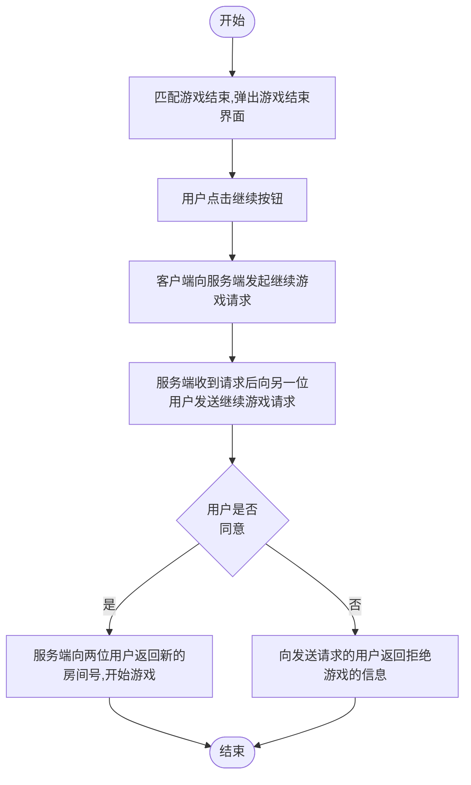

```mermaid
graph TD
    A([开始]) --> 匹配游戏结束,弹出游戏结束界面
    --> 用户点击继续按钮 --> 客户端向服务端发起继续游戏请求 --> 服务端收到请求后向另一位用户发送继续游戏请求 --> B{用户是否
    同意} -->|是|服务端向两位用户返回新的房间号,开始游戏 --> C([结束])

    B -->|否| 向发送请求的用户返回拒绝游戏的信息 -->C
```