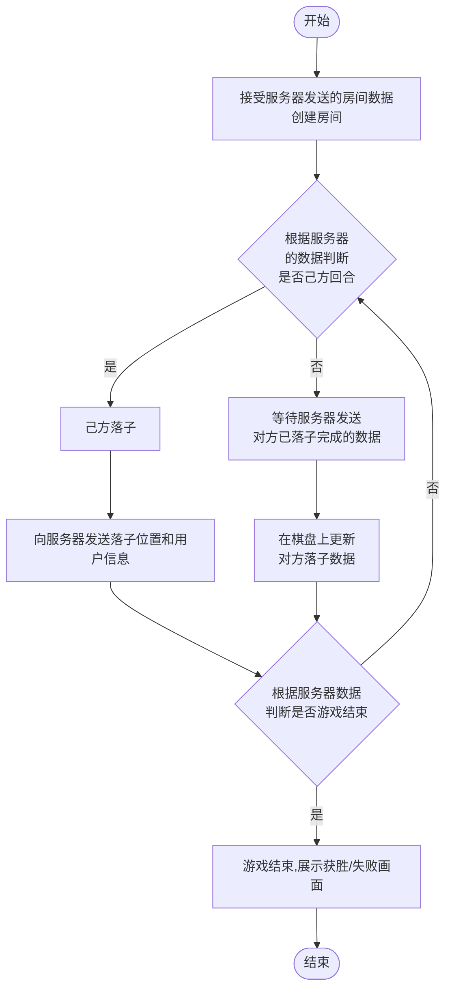

```mermaid
graph TB
A([开始]) --> B[接受服务器发送的房间数据创建房间] --> C{根据服务器
的数据判断
是否己方回合} -->|是| D[己方落子] --> E[向服务器发送落子位置和用户信息] --> F{根据服务器数据
判断是否游戏结束} -->|是| G[游戏结束,展示获胜/失败画面] --> H([结束])

C -->|否| I[等待服务器发送
对方已落子完成的数据] --> J[在棋盘上更新
对方落子数据] --> F

F -->|否| C
```